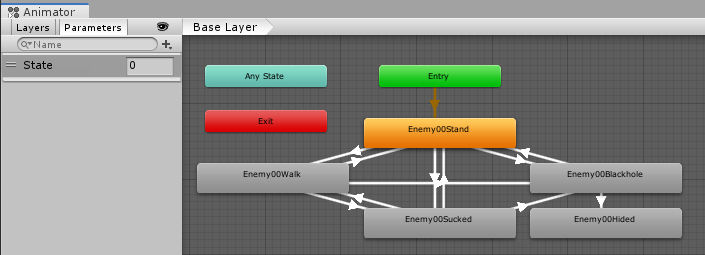
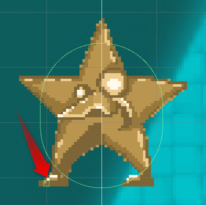

# 敵00の実装
敵の動きを実装します。ブラックホールに吸い込まれる処理は、ぐらびぃと同じものが使えるのでひとまず保留して、動きとアニメを実装します。プレイヤーの開発と同時に開発することが可能です。

# 動き方と状態
星型の敵の動き方を考えます。

- ゲームの返し前、ゲームオーバー、クリア、ポーズ中は静止
- ブラックホールの影響を受けず、縮み中でもなければ以下
  - 足元に地面がなければ重力落下
  - 地面がある時は前進
  - 歩く先に足場がない場合、移動方向を反転
- ブラックホールの影響下の時、吸い寄せられる
  - ブラックホールと衝突中、縮む
  - 縮みアニメが終わったらお菓子に変化
- ブラックホールと接触してなく、縮んでいる時は逆再生
  - 重力落下

状態は以下の通りです。

- CanMoveフラグで、動けるかどうかを示す
- ブラックホールの影響を受けたかどうかは毎回判定
- 通常状態、縮み中、縮みからの解放中を状態で記録
- 足元に地面があるかは、毎回Physics2D.BoxCastNonAllocで判定

# アニメ
アニメーションについて検討します。

- ゲームの開始直後は、Stand
- CanMoveがfalseの時は変更しない
- 落下中は、Stand
- 歩き中は、Walk
- 吸い寄せられ中は、Sucked
- 縮み中は、Blackhole
- 縮みからの解放は、Blackholeの逆再生

以上より、パラメーターを検討します。

- Integer型のStateを用意して、Stand, Walk, Sucked, Blackholeを制御
- 逆再生はスクリプトで制御

以上に従って、アニメーターを作成します。



ブラックホール以外のアニメからは、どのアニメへもスムーズに切り替わるように他のすべてのアニメにトランジションを設定しました。ブラックホールから戻る時は、大体空中だと思われることと、変形が大きくて一度Standが入っても違和感がないだろうということで、ブラックホール以外の時はスタンドに戻すようにしました。

# 動作
スクリプトを作成します。Enemy00という名前の新しいC#スクリプトを作成して、Enemy00プレハブにアタッチします。

## 変数、定数定義
検討した内容から、変数や列挙型、プロパティなどを宣言します。

```cs
        /// <summary>
        /// 行動状態の種類
        /// </summary>
        public enum StateType
        {
            Move,
            Blackhole,
            BlackholeReverse,
        }

        /// <summary>
        /// アニメ状態の種類。Stateに対応
        /// </summary>
        public enum AnimType
        {
            Stand,
            Walk,
            Sucked,
            Blackhole,
        }

        public bool CanMove
        {
            get
            {
                return !Fade.IsFading;
            }
        }

        StateType state = StateType.Move;
        Rigidbody2D rb = null;
        Animator anim = null;

```

## 初期化
コンポーネント類を取得します。アタッチされているオブジェクトから取得すればよいので、Awake()で行います。

```cs
        private void Awake()
        {
            state = StateType.Move;
            rb = GetComponent<Rigidbody2D>();
            anim = GetComponentInChildren<Animator>();
            anim.SetInteger("State", (int)AnimType.Stand);
        }
```

同時に、ゲームオブジェクトに必要なコンポーネントをアタッチして、設定します。Enemy00プレハブに、以下のコンポーネントをアタッチして、設定してください。

- TagとLayerにEnemyを定義して設定
  - 子供のオブジェクトは、UntaggedとDefaultのままにします。当たり判定がない子供のオブジェクトにTagやLayerを設定すると、検索する時などに含まれてしまったりするので、基本的には当たり判定に関係のないオブジェクトには設定しないのが無難です
- Enemy00スクリプトをアタッチ
- CapsuleCollider2Dをアタッチして、グラフィックに合わせて当たり判定を設定
- Rigidbody2Dをアタッチして、以下を設定
  - Linear DragをGraviyと同じ0.75にする
  - ConstraintsのFreeze RotationのZにチェックを入れて、回転しないようにする
  - AnimiatorはSpriteRendererを持っている子供のオブジェクトの方にアタッチ

## 開始前の処理
CanMoveがfalseの時は移動を停止して、それ以降の処理をキャンセルする処理を入れます。移動は物理エンジンに任せるので、FixedUpdate()に実装します。

```cs
        private void FixedUpdate()
        {
            if (!CanMove)
            {
                rb.velocity = Vector3.zero;
                return;
            }
        }
```

ここでPlayすると、Fadeが完了するまで静止して、Fadeが終わったら落下するようになります。

# 歩きの実装
ブラックホール関連の処理は後回しにして、歩きを実装します。あとで簡単に処理を切り替えられるように、処理は`UpdateMove()`というメソッドにまとめて、FixedUpdateから呼び出します。

## 着地処理
歩きを実装するには、着地しているかと、歩く先に足場があるかを調べる必要があります。着地しているかどうかは、Capsule Collider2DのGetContacts()で調べることができます。

処理に必要な変数を定義します。

```cs
        /// <summary>
        /// 衝突の上限数
        /// </summary>
        const int HitMax = 4;

        CapsuleCollider2D capCollider = null;
        ContactFilter2D contactFilter2D = new ContactFilter2D();
        ContactPoint2D[] contactPoints = new ContactPoint2D[HitMax];
```

Awake()にCapsuleCollider2Dの取得と、Mapレイヤーをチェックするためのマスク設定を追加します。

```cs
            capCollider = GetComponent<CapsuleCollider2D>();
            contactFilter2D.layerMask = LayerMask.GetMask("Map");
```

UpdateMove()を実装します。、CapsuleCollider2DのGetContacts()メソッドで、前回移動した時の接触情報を取得することができます。衝突した面が向いている方向(法線)を調べて、上向きのものがあれば着地していると見なすためにonGroundをtrueにしています。

```cs
        void UpdateMove()
        {
            bool onGround = false;

            // 着地チェック。上向きの接触があれば着地
            int hitCount = capCollider.GetContacts(contactFilter2D, contactPoints);
            for (int i=0; i<hitCount;i++)
            {
                if (contactPoints[i].normal.y >= 0.9f)
                {
                    onGround = true;
                }
            }

            if (onGround)
            {
                // 足場がある時は移動
                anim.SetInteger("State", (int)AnimType.Walk);
            }
            else
            {
                // 足場がない時は、アニメをStandに変更して慣性移動
                anim.SetInteger("State", (int)AnimType.Stand);
            }
        }
```

接触がうまく動いているかを確認するために、アニメの切り替えを行っています。メソッドができたら、FixedUpdate()の最後に、以下のようにメソッドの呼び出しを追加します。

```cs
        private void FixedUpdate()
        {
            if (!CanMove)
            {
                rb.velocity = Vector2.zero;
                return;
            }

            UpdateMove();
        }
```

以上で保存してPlayすると、空中は立ちパターン、着地すると歩くモーションに切り替わります。

## 歩かせる
向いている方向に歩かせます。歩くためには、歩く速度、向いている方向の2つのパラメーターが必要になります。向いている方向はSpriteRendererのflipXで判定できます。敵のスプライトは左向きなので、falseなら左、trueなら右向きです。

歩き速度とSpriteRendererを以下のように定義します。

```cs
        [Tooltip("歩く速度"), SerializeField]
        float walkSpeed = 1f;

        SpriteRenderer spRenderer = null;
```

Awake()に以下を追加します。Spriteは子のオブジェクトが持っているので、GetComponentInChildrenで取得します。

```cs
            spRenderer = GetComponentInChildren<SpriteRenderer>();
```

UpdateMove()内の着地している処理に、向いている方向に従って速度を設定します。

```cs
            if (onGround)
            {
                // 足場がある時は移動
                anim.SetInteger("State", (int)AnimType.Walk);
                Vector2 v = rb.velocity;
                v.x = spRenderer.flipX ? walkSpeed : -walkSpeed;
                rb.velocity = v;
            }
```

Playすると、着地した時に向いている方向に移動して地面がなくなると落下します。

## 方向転換
方向転換するかどうかは、移動先の足元に床があるかで判定します。プレイヤーの中心から、ある程度の距離の場所の足元をRaycastで調べることで床があるかの判定をします。

プログラムの前に、距離を確認するためにEnemy00にBoxCollider2Dをアタッチして座標を調べます。サイズを0.1ぐらいに小さくして、Offsetを動かして、それっぽい座標を調べます。



今回は、X方向が-1、Y方向が-1.5で計算できそうです。座標を確認したら、Box Collider 2Dは不要なのでRemoveします。

調べた位置と、下にチェックする距離を設定できるようにします。距離は、地面に届くのに十分な値であればOKです。また、RaycastHitNonAlloc()の戻り値を受け取るためのRaycastHit2Dの配列と、移動速度とアニメ速度の変換値も宣言しておきます。

```cs
        [Tooltip("足元の座標"), SerializeField]
        Vector2 footOffset = new Vector2(-1f, -1.5f);
        [Tooltip("足元チェックの距離"), SerializeField]
        float footCheckDistance = 0.2f;
        [Tooltip("歩き速度とアニメの係数"), SerializeField]
        float velocityToAnimSpeed = 0.75f;

        RaycastHit2D[] hits = new RaycastHit2D[HitMax];
```

反転チェックは、先に実装した歩く速度を設定知る前に実装します。足元の座標をoffsetに算出して、Physics2D.RaycastHitNonAlloc()で、真下に指定の距離にあるMapレイヤーのオブジェクトを取得します。接触するものがあれば、spRenderer.flipXを反転させて向きを変えます。向きを変えておけば、移動方向は先に実装済みなので動きます。移動速度から歩きのアニメ速度を調整するコードも加えました。

```cs
        void UpdateMove()
        {
            bool onGround = false;

            // 着地チェック。上向きの接触があれば着地
            int hitCount = capCollider.GetContacts(contactFilter2D, contactPoints);
            for (int i=0; i<hitCount;i++)
            {
                if (contactPoints[i].normal.y >= 0.9f)
                {
                    onGround = true;
                }
            }

            if (onGround)
            {
                // 足場がある時は移動
                anim.SetInteger("State", (int)AnimType.Walk);

                // 反転チェック
                Vector3 offset = footOffset;
                if (spRenderer.flipX)
                {
                    offset.x = -offset.x;
                }
                var footPos = transform.position + offset;
                hitCount = Physics2D.RaycastNonAlloc(
                    footPos,
                    Vector2.down,
                    hits,
                    footCheckDistance,
                    LayerMask.GetMask("Map"));
                if (hitCount == 0)
                {
                    spRenderer.flipX = !spRenderer.flipX;
                }
                anim.speed = Mathf.Abs(rb.velocity.x) * velocityToAnimSpeed;

                Vector2 v = rb.velocity;
                v.x = spRenderer.flipX ? walkSpeed : -walkSpeed;
                rb.velocity = v;
            }
            else
            {
                // 足場がない時は、アニメをStandに変更して慣性移動
                anim.SetInteger("State", (int)AnimType.Stand);
            }
        }
```

以上で移動は完成です。
