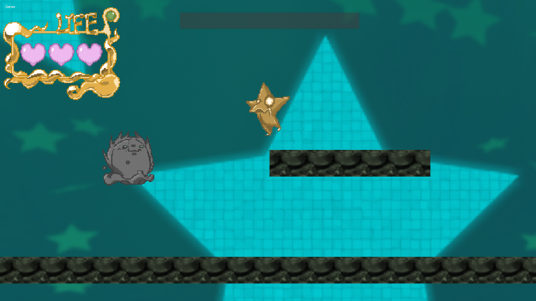

# ぐらびぃの制御

シーン遷移、モック画面ができたら、ゲームの中身の開発を開始します。

まず真っ先に手を付けたいのが、やはりゲームの要となるプレイヤーの動きでしょう。ということで、その通りに進めていきます。

## 仕様を決める
プログラミングの鉄則は、コードを書く前に、作るものの詳細を決めておくことです。実験的な作品の場合は作りながら仕様を考えることになりますが、少なくともこれから作る分の仕様は決めておきます。

### 操作方法
操作方法を具体的にまとめます。

- マウスのボタンを押すと、マウスカーソルの場所にブラックホールが発生する
- ドラッグで、ブラックホールはマウスカーソルの場所を目指して移動
- マウスのボタンを離すと、ブラックホールは消滅
- ESCキーでゲームを一時停止

今回の場合、主人公はぐらびぃですが、直接操作するのはブラックホールです。ということで、ブラックホールから作る方が自然でしょう。

### ブラックホールの状態を決める
ゲームの状況によって、操作と動きが切り替わることがあります。そのような動きを作りやすくするために、ゲーム中にどのような状態があるかを決めて、変数などで管理するのが一般的です。状態を切り替えることを**状態遷移**(じょうたいせんい)と呼びます。状態を英語でいうと**State**(ステート)です。状態を切り替えながら動作する仕組みのことを**State Machine**(ステートマシーン)といいます。UnityのAnimatorはState Machineです。

まずは、ゲームがスタートしてからの流れでどのようなことがブラックホールに起き得るかをリストアップします。

- ステージシーンがフェードイン。Go!の文字が表示されるまで操作不可
- Go!の表示後、何もしないとそのまま待機
- マウスボタンを押すと、ブラックホール発生
- エネルギーがなくなると消える
- マウスの操作で動く
- マウスのボタンを離すと消える
- クリアすると消える
- ゲームオーバーになるとそのままの状態で操作不可
- ポーズ中はそのままの状態で操作不可

以上から、状態を切り分けます。操作と動きを基準に検討していきます。

- 操作不能状態
  - Go!が開始される前
  - ゲームオーバー
  - クリア
  - ポーズ中
- ブラックホールが発生していない状態
  - 操作可能で、ボタンが押されていない
  - エネルギーがない
- ブラックホール発生中
  - 操作可能で、ボタンが押されている
  - エネルギーが残っている

状態はかなりシンプルです。以下の2つのフラグで管理できそうです。

- 操作が可能な時にtrueを返すboolフラグ
- ブラックホールが発生している時にtrueを返すboolフラグ

ゲームの状況や操作に応じて、上記のフラグを切り替えるようにして、ブラックホールは設定されたフラグに合わせて動けばよいでしょう。

重力落下しつつ、慣性で移動。ただし空気抵抗あり
- ブラックホール発生時、引き寄せられる
- 敵や障害物にぶつかるとミス
  - 弾き飛ばされて、一定時間無敵
- ライフがなくなるとゲームオーバー
- ゴールに辿り着くとクリア
- ESCキーでポーズ
- お菓子に触れたら食べる

プレイヤーに起き得るかをリストアップします。

- ステージシーンがフェードイン。Go!の文字が表示されるまで操作不可で移動もしない
- Go!の表示後、何もしないと重力落下しつつ、慣性で移動。ただし空気抵抗あり
- ブラックホール発生時、引き寄せられる
- 敵や障害物にぶつかるとミス
  - 弾き飛ばされて、一定時間無敵
- ライフがなくなるとゲームオーバー
- ゴールに辿り着くとクリア
- ESCキーでポーズ
- お菓子に触れたら食べる

状態は、操作と動作が同じかどうかで切り分けていくと分かりやすいです。

- 画面内をクリックすると、ブラックホールが出現する
  - ブラックホールに向かって、プレイヤーは吸い寄せられる
  - 吸い寄せは、ボタンを押した瞬間から有効
- マウスドラッグで、ブラックホールも移動。最高速度あり
- ボタンを離すとブラックホール消滅
  - 消滅中は、吸い寄せ効果はなくなる
- 敵やトゲに触れるとミス
  - ライフが減る
  - 一定時間無敵になる
  - 少しノックバック
  - 操作は可能
  - ライフが無くなると
