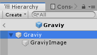

# ぐらびぃの制御

ブラックホールの制御ができたら、ぐらびぃの移動を実装できます。ブラックホールの時と同様に、まずは状態の洗い出しから行います。

# ぐらびぃの状態

## 状況を検討
まずは、ゲーム開始からぐらびぃがどのような状況になるかをリストアップします。

- ゲームが開始するまでは移動しない
- ゲームが開始したら、重力落下しつつ、慣性で移動
- ブラックホールが発生したら引き寄せられる
- 敵や障害物にぶつかるとミス
  - 弾き飛ばされて、一定時間無敵
- ライフがなくなるとゲームオーバー
- ゴールに辿り着くとクリア
- ESCキーでポーズ
- お菓子に触れたら食べる

## 状態を決める
以上を元に、入出力が変わるかどうかに着目して、状態を決めていきます。

- 移動なし
  - 開始まで
  - ゲームオーバー
  - クリア
  - ポーズ中
- ブラックホールの勢力圏内
  - 吸い寄せられる
  - 引き寄せられる方向に向きを変える
- ブラックホールが発生していないか、勢力圏外
  - 慣性移動＋落下
- 無敵時間
  - ミスしてから一定時間
- 食べるアニメーション
  - 操作は通常通り
  - 吸い込み中のアイテムがある場合は、口を空けておく
  - 吸い込みが完了したら、アニメを逆再生して口を閉じる

## 動作用の変数を決める
状態は、以下のパラメーターで制御できそうです。

- 移動可能かどうかのCanMoveフラグ
- ブラックホールの最大距離
- ブラックホールの距離を加速度に変換する際の調整値
- 残りの無敵秒数を入れておくfloat変数`mutekiTime`
- 食べるアニメ中フラグ(あとで検討)

これもシンプルで、排他的な動作がないので、状態を通し番号で管理する変数はなしでよいでしょう。

## アニメーションを決める
ぐらびぃのアニメは以下の種類があります。それぞれの要件をあわせて書き出します。

- Idle 通常時
  - ブラックホールの影響下にない
- Fall 落下
  - ゲームが開始している
  - ブラックホールの影響下にない
  - 地面がない
- Sucked ブラックホールに吸い込まれ
  - ゲームが開始している
  - ブラックホールの影響下にある
- Inhale 食べる
  - 食べるが発動した
- Hungry はらぺこ
  - エネルギーが一定以下の時
- 無敵中(α値を下げる)
  - 無敵時間が0より大きい

以上から、必要なパラメーターを検討します。

- IdleかFallかSuckedは排他的に切り替わるアニメなので、int型のStateパラメーターを作成して、値で制御する
- Inhaleはどの状態からでも発動して、スクリプトのタイミングで終了する。Bool型のInhaleで制御する。また、口を閉じるアニメはSpeedを-1にしたいので、Float型のEatSpeedを定義して、SpeedのMultiplierに設定する
- Hungryは、グラフィックが用意できるのであれば、Idle、Fall、Suckedのそれぞれに対応するものがある。同期した別レイヤーを作成して、スクリプト側からウェイトの変更で切り替える
- 無敵は、他のアニメと同時に発生する可能性がある。別レイヤーで半透明を設定し、Float型のMutekiTimeで制御する

以上で方針が決まったので、アニメーターを作成します。

### Layers
レイヤーを以下のように作成します。


- Base Layerはデフォルトのまま
- Hungry Layerは以下のように設定します
  - Weightは0
  - Override
  - Syncにチェックをして、Source Layerは*Base Layer*
- Muteki Layerは以下のように設定します
  - Weightは1
  - Override

### Parameters
パラメーターは以下の通りです。


- Stateはinteger
- InhaleはBool
- EatSpeedはFloat
- MutekiTimeはFloat

### 状態遷移
Base Layerの状態遷移は以下のようにして、上記で検討したようにトランジションを設定しました。Hungry LayerはSyncしているので自動的に同じ状態遷移になります。はらべこアニメが用意できている状態に設定し、ない場合はBaseを同じアニメを設定しておけばよいでしょう。


Muteki Layerは以下のようにシンプルです。MutekiTimeが0より大きければMutekiに遷移して、0.001未満なら何もアニメを設定していないNoneに切り替えます。


以上でアニメは出来上がりです。


# 動きを作る
ぐらびぃを動かすスクリプトを検討します。ぐらびぃは以下のように動きます。

- ゲーム開始まで待機
- 通常は、重力落下をする慣性移動
- ブラックホールの勢力下にあったら、そちらに吸い込まれる
- 画面の左には出ない(スクロールは戻らない)
- 敵にぶつかったらミス
- ライフがなくなるとゲームオーバー
- クリアオブジェクトに触れるとクリア
- アイテムを取ったら食べる
- エネルギーの消費と回復

`Graviy`という名前のC#スクリプトを作成して、Graviyプレハブにアタッチして、そこにコードを書いていきます。ブラックホールで検討したエネルギーのパラメーターもここに実装します。

開発事項が多い場合は、まとめて作ることはせず、１つずつ作っては動作を確認していく方が、バグも少なく、開発もしやすいです。

# 変数の定義
先に検討した内容に従って、変数を定義します。

```cs
public static Graviy Instance = null;

[Tooltip("ブラックホールの最大距離"), SerializeField]
float distanceMax = 15f;
[Tooltip("ブラックホールの距離が0の時の加速度"), SerializeField]
float speedMax = 3f;
[Tooltip("重力係数"), SerializeField]
float gravityScale = 1f;

public enum AnimType
{
  Idle,
  Sucked,
  Fall,
}

/// <summary>
/// 無敵秒数
/// </summary>
static float mutekiTime = 0f;

static Rigidbody2D rb = null;
static Animator anim = null;

/// <summary>
/// 移動可能かどうかのフラグ
/// </summary>
public static bool CanMove
{
    get
    {
        return !Fade.IsFading;
    }
}

```

他のキャラから簡単にアクセスできるように、自分自身のインスタンスをInstanceに持つことにします。また、Graviyはゲーム全体で同時に1体しかでないため、可能なものはアクセスが楽になるようにstaticにします。アニメのStateの状態も、列挙子で定義しておきます。

# 起動時の処理
起動時に、自らのインスタンスをキャッシュし、コンポーネントを取得します。自分自身の情報は、Awakeで取得しておきます。

```cs
void Awake()
{
    Instance = this;
    rb = GetComponent<Rigidbody2D>();
    anim = GetComponent<Animator>();
    anim.SetInteger("State", (int)AnimType.Idle);
}
```

# ゲーム開始まで待機
動作が可能になるまでは待機アニメのままで静止させておきます。移動処理は物理演算ベースで行います。

```cs
        void FixedUpdate()
        {
            if (!CanMove)
            {
                rb.velocity = Vector3.zero;
                return;
            }
        }
```

Graviyのプレハブは以下のような親子構成にしました。



親子それぞれのコンポーネントです。

- Graviyのコンポーネント
  - Capsule Collider 2D
  - Graviy(動かすためのC#スクリプト)
  - Rigidbody 2D
    - ConstraintsのFreeze Rotation Zにチェック
- GraviyImage
  - Sprite Renderer
  - Animator

以上ができたらPlayをして動きを確認します。フェード中はIdle状態で空中にいて、フェードが完了したら落下するようになりました。

# ブラックホールに引き寄せられる
ブラックホールに引き寄せられる仕様を決めます。要件は以下の通りです。

- ブラックホールの発生しはじめと発生している間、引き寄せられる
- ブラックホールが近いほど、引き寄せられる力が強くなる

距離によって引き寄せられる力を変化させる方法はいろいろと考えられますが、今回は以下の通りとします。

- Rigidbody2DのAddForceで、距離に応じた力を加える
- 力は更新間隔に関係なく設定したいので、ForceMode2D.Forceを使う
- 加える力は、負の傾斜の直線の式(y=ax+b。ただし、aは負の値)で求めるものとします

以上から、実装してみてください。参考までに、それっぽい動きにするパラメーターの一例を示します。

- distanceMaxを15
- speedMaxを25
- Rigidbody2DのLinear Dragを0.75

# 左に出ないようにする
ぐらびぃを画面の左に出ないようにします。画面のすぐ外に当たり判定を置いて、Rigidbodyに任せる方法もありますが、スクリプトで制御してみます。

## 考え方
ぐらびぃの左端が、画面の外に出ないように調整します。

- ぐらびぃの左側は、当たり判定の左端で表すことができる
- 画面の外かどうかは、ぐらびぃの左端のワールド座標が、カメラのビューポート座標の0より小さいかどうかで判定できる
- ぐらびぃを画面内に収めるためには、ビューポートの0のワールド座標から、当たり判定の中心までの幅を加える
- 処理は、描画直前に行うのがよいので、カメラの座標の更新後に呼び出すのが最適

## 変数の追加
当たり判定が必要なので、CapsuleCollider2Dのインスタンスをキャッシュする変数を用意してます。また、カメラのキャッシュ用の変数も用意します。CapsuleCollider2Dは自分のパラメーターなのでAwake()、カメラは他のオブジェクトなのでStart()で初期化します。

以下を、インスタンス変数を宣言するのに適切な場所に追加します。

```cs
static CapsuleCollider2D capsuleCollider2D = null;
static Camera mainCamera = null;
```

Awake()内に以下を追加します。

```cs
capsuleCollider2D = GetComponent<CapsuleCollider2D>();
```

Start()を追加します。

```cs
private void Start()
{
    mainCamera = Camera.main;
}
````

## メソッドの作成
`public void AdjustLeftPosition()`のようなメソッドを追加して、以下のような処理を実装します。

```cs
public void AdjustLeftPosition()
{
    // 当たり判定の左端座標
    var left = capsuleCollider2D.bounds.min;

    // ビューポート座標に変換
    var vpos = mainCamera.WorldToViewportPoint(left);

    // 負の値なら補正
    if (vpos.x < 0f)
    {
      // Vector3.zeroをビューポートからワールド座標に変換した値を求める
      // 求めた座標のXに、capsuleCollider2D.bounds.extents.xを足せば、左端の時のぐらびぃの中心X座標を求めることができる
      // YとZはそのままで、X座標を求めた左端座標にする
    }
}
```

# アニメ
基本的な動きができたので、アニメを連動させます。

ブラックホールの影響を受けて力を加えていれば以下をします。

- アニメのStateをSuckedに設定
- ブラックホールが左なら、SpriteRendererのFlipXを有効に、右なら無効にする

ブラックホールの影響がないときは、Y速度でアニメを切り替えます。

- Y速度が0以上ならIdle、そうでなければFall

以上で作成します。

## 変数追加
SpriteRendererが必要なので、インスタンス変数に追加して、Awakeでコンポーネントを取得します。

インスタンス変数を宣言するのに適切な場所に以下を追加。
```cs
static SpriteRenderer spRenderer = null;
```

Awake()内に以下を追加

```cs
spRenderer = GetComponentInChildren<SpriteRenderer>();
```

FixedUpdate()に以下のような処理を加えます。

- ブラックホールが発生しているかの判定の前に、bool型のローカル変数isSuckedを定義して、falseを代入しておく
- AddForceをしたらブラックホールの影響を受けたということになるので、直下に以下の処理を追加
  - アニメのStateをSucked
  - ブラックホールがぐらびぃの左ならspRenderer.SpriteRendererのflipXをtrue、右ならfalseにする
  - isSuckedにtrueを代入
- ブラックホールが発生している時のif文が終わったところで、isSuckedがfalseかを判定して、以下を処理
  - rb.velocity.yが0以上なら上昇しているので、アニメのStateをIdleにする
  - 下降しているなら、アニメをFallにする

以上で基本操作は実装完了です。一旦、カメラの実装に移りましょう。
